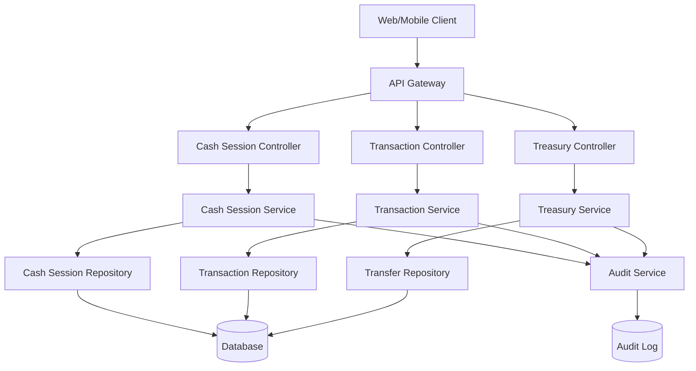
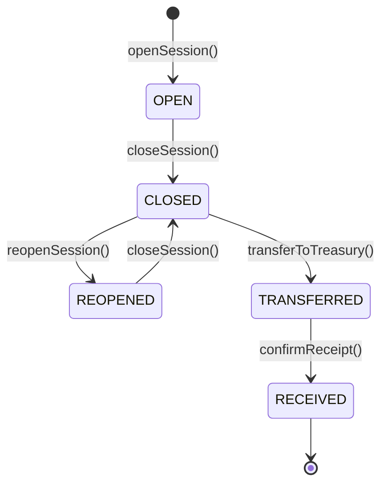

# Sistema de Gestão de Caixa - Design Document

## 1. Overview

O Sistema de Gestão de Caixa é um módulo crítico que gerencia todo o fluxo financeiro do estabelecimento, desde a abertura do caixa até a transferência para tesouraria. O sistema garante rastreabilidade completa, auditoria e conformidade fiscal.

### 1.1 Objetivos

- Controlar abertura e fechamento de caixas
- Registrar todas as transações financeiras
- Gerenciar sangrias e suprimentos
- Realizar conferência detalhada de valores
- Transferir valores para tesouraria
- Gerar relatórios gerenciais e de auditoria
- Garantir segurança e rastreabilidade

### 1.2 Escopo

**Incluído:**
- Gestão de turnos de caixa
- Registro de transações
- Conferência e fechamento
- Transferência para tesouraria
- Relatórios e auditoria
- Integração com sistema de vendas

**Não Incluído:**
- Processamento de pagamentos (integração externa)
- Emissão de notas fiscais (módulo separado)
- Gestão de contas a pagar/receber
- Conciliação bancária

## 2. Architecture

### 2.1 System Architecture

```
┌─────────────────────────────────────────────────────────────┐
│                    CASH MANAGEMENT SYSTEM                    │
├─────────────────────────────────────────────────────────────┤
│                                                               │
│  ┌──────────────┐  ┌──────────────┐  ┌──────────────┐      │
│  │   Cash       │  │  Transaction │  │   Treasury   │      │
│  │   Session    │◄─┤   Manager    │─►│   Manager    │      │
│  │   Manager    │  └──────────────┘  └──────────────┘      │
│  └──────┬───────┘                                            │
│         │                                                     │
│         ├──────────────┬──────────────┬──────────────┐      │
│         ▼              ▼              ▼              ▼      │
│  ┌──────────┐  ┌──────────┐  ┌──────────┐  ┌──────────┐   │
│  │  Opening │  │  Closing │  │  Report  │  │  Audit   │   │
│  │  Service │  │  Service │  │  Service │  │  Service │   │
│  └──────────┘  └──────────┘  └──────────┘  └──────────┘   │
│                                                               │
└─────────────────────────────────────────────────────────────┘
                            │
                            ▼
┌─────────────────────────────────────────────────────────────┐
│                      INTEGRATION LAYER                       │
├─────────────────────────────────────────────────────────────┤
│  Sales System  │  User Auth  │  Notifications  │  Reports   │
└─────────────────────────────────────────────────────────────┘
```

### 2.2 Component Diagram




## 3. Components and Interfaces

### 3.1 Cash Session Manager

**Responsabilidades:**
- Gerenciar ciclo de vida de turnos de caixa
- Validar regras de negócio
- Coordenar abertura e fechamento
- Controlar status de sessões

**Interface:**
```typescript
interface ICashSessionManager {
  openSession(data: OpenSessionDTO): Promise<CashSession>
  closeSession(sessionId: string, data: CloseSessionDTO): Promise<CashSession>
  reopenSession(sessionId: string, reason: string): Promise<CashSession>
  getActiveSession(operatorId: string): Promise<CashSession | null>
  getSessionDetails(sessionId: string): Promise<CashSessionDetails>
  listSessions(filters: SessionFilters): Promise<PaginatedResult<CashSession>>
}
```

### 3.2 Transaction Manager

**Responsabilidades:**
- Registrar transações financeiras
- Processar sangrias e suprimentos
- Vincular vendas ao caixa
- Atualizar saldos em tempo real

**Interface:**
```typescript
interface ITransactionManager {
  recordSale(sessionId: string, sale: SaleDTO): Promise<CashTransaction>
  recordWithdrawal(sessionId: string, data: WithdrawalDTO): Promise<CashTransaction>
  recordSupply(sessionId: string, data: SupplyDTO): Promise<CashTransaction>
  cancelTransaction(transactionId: string, reason: string): Promise<void>
  getSessionTransactions(sessionId: string): Promise<CashTransaction[]>
  getSessionBalance(sessionId: string): Promise<SessionBalance>
}
```

### 3.3 Treasury Manager

**Responsabilidades:**
- Gerenciar transferências para tesouraria
- Confirmar recebimentos
- Registrar divergências
- Consolidar valores

**Interface:**
```typescript
interface ITreasuryManager {
  transferToTreasury(sessionId: string, data: TransferDTO): Promise<CashTransfer>
  confirmReceipt(transferId: string, data: ReceiptDTO): Promise<CashTransfer>
  listPendingTransfers(): Promise<CashTransfer[]>
  getDailyConsolidation(date: Date): Promise<DailyConsolidation>
}
```

### 3.4 Closing Service

**Responsabilidades:**
- Processar fechamento de caixa
- Realizar conferência de valores
- Calcular quebras
- Gerar relatórios de fechamento

**Interface:**
```typescript
interface IClosingService {
  startClosing(sessionId: string): Promise<ClosingPreview>
  recordCashCount(sessionId: string, counts: CashCountDTO[]): Promise<CashCount[]>
  calculateDifference(sessionId: string): Promise<CashDifference>
  finalizeClosure(sessionId: string, data: FinalizeDTO): Promise<ClosureReport>
}
```

### 3.5 Report Service

**Responsabilidades:**
- Gerar relatórios gerenciais
- Consolidar dados financeiros
- Exportar relatórios
- Calcular métricas

**Interface:**
```typescript
interface IReportService {
  generateSessionReport(sessionId: string): Promise<SessionReport>
  generateDailyReport(date: Date): Promise<DailyReport>
  generateCashBreakReport(filters: ReportFilters): Promise<CashBreakReport>
  generateOperatorPerformance(operatorId: string, period: Period): Promise<PerformanceReport>
  exportReport(reportId: string, format: 'PDF' | 'EXCEL'): Promise<Buffer>
}
```

### 3.6 Audit Service

**Responsabilidades:**
- Registrar logs de auditoria
- Rastrear alterações
- Garantir imutabilidade
- Gerar trilhas de auditoria

**Interface:**
```typescript
interface IAuditService {
  logAction(action: AuditAction): Promise<void>
  getAuditTrail(entityId: string, entityType: string): Promise<AuditLog[]>
  searchAuditLogs(filters: AuditFilters): Promise<PaginatedResult<AuditLog>>
  generateAuditReport(sessionId: string): Promise<AuditReport>
}
```


## 4. Data Models

### 4.1 Database Schema

```prisma
model CashRegister {
  id              String        @id @default(uuid())
  number          Int           @unique
  name            String
  establishmentId String
  isActive        Boolean       @default(true)
  createdAt       DateTime      @default(now())
  updatedAt       DateTime      @updatedAt
  
  sessions        CashSession[]
  establishment   Establishment @relation(fields: [establishmentId], references: [id])
  
  @@index([establishmentId])
  @@map("cash_registers")
}

model CashSession {
  id                String              @id @default(uuid())
  cashRegisterId    String
  operatorId        String
  openingAmount     Decimal             @db.Decimal(10, 2)
  expectedAmount    Decimal?            @db.Decimal(10, 2)
  countedAmount     Decimal?            @db.Decimal(10, 2)
  difference        Decimal?            @db.Decimal(10, 2)
  status            CashSessionStatus   @default(OPEN)
  openedAt          DateTime            @default(now())
  closedAt          DateTime?
  transferredAt     DateTime?
  receivedAt        DateTime?
  treasurerUserId   String?
  notes             String?             @db.Text
  reopenReason      String?             @db.Text
  
  cashRegister      CashRegister        @relation(fields: [cashRegisterId], references: [id])
  operator          User                @relation("CashOperator", fields: [operatorId], references: [id])
  treasurer         User?               @relation("CashTreasurer", fields: [treasurerUserId], references: [id])
  transactions      CashTransaction[]
  counts            CashCount[]
  transfer          CashTransfer?
  
  @@index([cashRegisterId])
  @@index([operatorId])
  @@index([status])
  @@index([openedAt])
  @@map("cash_sessions")
}

model CashTransaction {
  id              String              @id @default(uuid())
  cashSessionId   String
  type            TransactionType
  paymentMethod   PaymentMethod?
  amount          Decimal             @db.Decimal(10, 2)
  description     String?
  saleId          String?
  userId          String
  timestamp       DateTime            @default(now())
  metadata        Json?
  
  cashSession     CashSession         @relation(fields: [cashSessionId], references: [id])
  sale            Sale?               @relation(fields: [saleId], references: [id])
  user            User                @relation(fields: [userId], references: [id])
  
  @@index([cashSessionId])
  @@index([type])
  @@index([timestamp])
  @@map("cash_transactions")
}

model CashCount {
  id              String      @id @default(uuid())
  cashSessionId   String
  denomination    Decimal     @db.Decimal(10, 2)
  quantity        Int
  total           Decimal     @db.Decimal(10, 2)
  createdAt       DateTime    @default(now())
  
  cashSession     CashSession @relation(fields: [cashSessionId], references: [id])
  
  @@index([cashSessionId])
  @@map("cash_counts")
}

model CashTransfer {
  id              String      @id @default(uuid())
  cashSessionId   String      @unique
  transferredBy   String
  receivedBy      String?
  expectedAmount  Decimal     @db.Decimal(10, 2)
  receivedAmount  Decimal?    @db.Decimal(10, 2)
  difference      Decimal?    @db.Decimal(10, 2)
  notes           String?     @db.Text
  transferredAt   DateTime    @default(now())
  receivedAt      DateTime?
  
  cashSession     CashSession @relation(fields: [cashSessionId], references: [id])
  transferrer     User        @relation("Transferrer", fields: [transferredBy], references: [id])
  receiver        User?       @relation("Receiver", fields: [receivedBy], references: [id])
  
  @@index([cashSessionId])
  @@index([transferredAt])
  @@map("cash_transfers")
}

enum CashSessionStatus {
  OPEN
  CLOSED
  TRANSFERRED
  RECEIVED
  REOPENED
}

enum TransactionType {
  SALE
  WITHDRAWAL
  SUPPLY
  OPENING
  CLOSING
  ADJUSTMENT
}

enum PaymentMethod {
  CASH
  DEBIT
  CREDIT
  PIX
  VOUCHER
  OTHER
}
```

### 4.2 DTOs (Data Transfer Objects)

```typescript
// Opening
interface OpenSessionDTO {
  cashRegisterId: string
  operatorId: string
  openingAmount: number
}

// Closing
interface CloseSessionDTO {
  countedAmount: number
  counts: CashCountDTO[]
  notes?: string
}

interface CashCountDTO {
  denomination: number  // 200, 100, 50, 20, 10, 5, 2, 1, 0.50, 0.25, 0.10, 0.05
  quantity: number
}

// Transactions
interface WithdrawalDTO {
  amount: number
  reason: string
  authorizedBy?: string
}

interface SupplyDTO {
  amount: number
  reason: string
  authorizedBy?: string
}

interface SaleDTO {
  saleId: string
  amount: number
  paymentMethod: PaymentMethod
  changeGiven?: number
}

// Transfer
interface TransferDTO {
  cashAmountToTransfer: number
  otherPaymentsTotal: number
  notes?: string
}

interface ReceiptDTO {
  receivedAmount: number
  receivedBy: string
  notes?: string
}
```


## 5. Business Logic

### 5.1 Cash Session Lifecycle



### 5.2 Opening Logic

```typescript
async openSession(data: OpenSessionDTO): Promise<CashSession> {
  // 1. Validate operator doesn't have open session
  const existingSession = await this.getActiveSession(data.operatorId)
  if (existingSession) {
    throw new BusinessError('Operator already has an open session')
  }
  
  // 2. Validate opening amount
  if (data.openingAmount < MIN_OPENING_AMOUNT || data.openingAmount > MAX_OPENING_AMOUNT) {
    throw new ValidationError('Opening amount must be between R$ 50 and R$ 500')
  }
  
  // 3. Create session
  const session = await this.repository.create({
    ...data,
    status: 'OPEN',
    openedAt: new Date()
  })
  
  // 4. Record opening transaction
  await this.transactionManager.recordTransaction({
    cashSessionId: session.id,
    type: 'OPENING',
    amount: data.openingAmount,
    userId: data.operatorId
  })
  
  // 5. Log audit
  await this.auditService.logAction({
    action: 'CASH_SESSION_OPENED',
    entityId: session.id,
    userId: data.operatorId,
    details: { openingAmount: data.openingAmount }
  })
  
  return session
}
```

### 5.3 Closing Logic

```typescript
async closeSession(sessionId: string, data: CloseSessionDTO): Promise<CashSession> {
  // 1. Get session and validate
  const session = await this.repository.findById(sessionId)
  if (!session || session.status !== 'OPEN') {
    throw new BusinessError('Session not found or not open')
  }
  
  // 2. Calculate expected amount
  const balance = await this.transactionManager.getSessionBalance(sessionId)
  const expectedAmount = balance.cashBalance
  
  // 3. Record cash counts
  await this.closingService.recordCashCount(sessionId, data.counts)
  
  // 4. Calculate difference
  const difference = data.countedAmount - expectedAmount
  const differencePercent = Math.abs(difference / expectedAmount) * 100
  
  // 5. Validate justification if needed
  if (differencePercent > MAX_DIFFERENCE_PERCENT && !data.notes) {
    throw new ValidationError('Justification required for cash break above 1%')
  }
  
  // 6. Update session
  const updatedSession = await this.repository.update(sessionId, {
    status: 'CLOSED',
    expectedAmount,
    countedAmount: data.countedAmount,
    difference,
    closedAt: new Date(),
    notes: data.notes
  })
  
  // 7. Notify if significant break
  if (differencePercent > NOTIFICATION_THRESHOLD) {
    await this.notificationService.notifySupervisor({
      type: 'CASH_BREAK_ALERT',
      sessionId,
      difference,
      percent: differencePercent
    })
  }
  
  // 8. Log audit
  await this.auditService.logAction({
    action: 'CASH_SESSION_CLOSED',
    entityId: sessionId,
    userId: session.operatorId,
    details: { expectedAmount, countedAmount: data.countedAmount, difference }
  })
  
  return updatedSession
}
```

### 5.4 Withdrawal (Sangria) Logic

```typescript
async recordWithdrawal(sessionId: string, data: WithdrawalDTO): Promise<CashTransaction> {
  // 1. Get session and validate
  const session = await this.repository.findById(sessionId)
  if (!session || session.status !== 'OPEN') {
    throw new BusinessError('Session not found or not open')
  }
  
  // 2. Get current balance
  const balance = await this.getSessionBalance(sessionId)
  
  // 3. Validate withdrawal amount
  const remainingCash = balance.cashBalance - data.amount
  if (remainingCash < session.openingAmount) {
    throw new BusinessError('Withdrawal would leave cash below opening amount')
  }
  
  // 4. Check authorization if needed
  if (data.amount > WITHDRAWAL_AUTHORIZATION_LIMIT && !data.authorizedBy) {
    throw new ValidationError('Authorization required for withdrawals above limit')
  }
  
  // 5. Record transaction
  const transaction = await this.repository.createTransaction({
    cashSessionId: sessionId,
    type: 'WITHDRAWAL',
    amount: -data.amount,  // Negative for withdrawal
    description: data.reason,
    userId: session.operatorId,
    metadata: { authorizedBy: data.authorizedBy }
  })
  
  // 6. Log audit
  await this.auditService.logAction({
    action: 'CASH_WITHDRAWAL',
    entityId: transaction.id,
    userId: session.operatorId,
    details: { amount: data.amount, reason: data.reason }
  })
  
  return transaction
}
```

### 5.5 Transfer to Treasury Logic

```typescript
async transferToTreasury(sessionId: string, data: TransferDTO): Promise<CashTransfer> {
  // 1. Get session and validate
  const session = await this.repository.findById(sessionId)
  if (!session || session.status !== 'CLOSED') {
    throw new BusinessError('Session must be closed before transfer')
  }
  
  // 2. Calculate transfer amount (excluding opening amount that stays)
  const transferAmount = session.countedAmount - session.openingAmount
  
  // 3. Validate transfer amount
  if (transferAmount < 0) {
    throw new BusinessError('Cannot transfer negative amount')
  }
  
  // 4. Create transfer record
  const transfer = await this.transferRepository.create({
    cashSessionId: sessionId,
    transferredBy: session.operatorId,
    expectedAmount: transferAmount,
    notes: data.notes
  })
  
  // 5. Update session status
  await this.repository.update(sessionId, {
    status: 'TRANSFERRED',
    transferredAt: new Date()
  })
  
  // 6. Notify treasury
  await this.notificationService.notifyTreasury({
    type: 'TRANSFER_PENDING',
    transferId: transfer.id,
    amount: transferAmount,
    operator: session.operator.name
  })
  
  // 7. Log audit
  await this.auditService.logAction({
    action: 'CASH_TRANSFERRED',
    entityId: transfer.id,
    userId: session.operatorId,
    details: { amount: transferAmount }
  })
  
  return transfer
}
```


## 6. API Endpoints

### 6.1 Cash Session Endpoints

```typescript
// Open cash session
POST /api/v1/cash/sessions
Body: {
  cashRegisterId: string
  openingAmount: number
}
Response: CashSession

// Get active session for operator
GET /api/v1/cash/sessions/active
Response: CashSession | null

// Get session details
GET /api/v1/cash/sessions/:id
Response: CashSessionDetails

// Close session
POST /api/v1/cash/sessions/:id/close
Body: {
  countedAmount: number
  counts: CashCountDTO[]
  notes?: string
}
Response: CashSession

// Reopen session (supervisor only)
POST /api/v1/cash/sessions/:id/reopen
Body: {
  reason: string
}
Response: CashSession

// List sessions
GET /api/v1/cash/sessions
Query: {
  status?: CashSessionStatus
  operatorId?: string
  startDate?: string
  endDate?: string
  page?: number
  limit?: number
}
Response: PaginatedResult<CashSession>
```

### 6.2 Transaction Endpoints

```typescript
// Record withdrawal (sangria)
POST /api/v1/cash/sessions/:id/withdrawals
Body: {
  amount: number
  reason: string
  authorizedBy?: string
}
Response: CashTransaction

// Record supply (suprimento)
POST /api/v1/cash/sessions/:id/supplies
Body: {
  amount: number
  reason: string
  authorizedBy?: string
}
Response: CashTransaction

// Get session transactions
GET /api/v1/cash/sessions/:id/transactions
Response: CashTransaction[]

// Get session balance
GET /api/v1/cash/sessions/:id/balance
Response: {
  openingAmount: number
  salesTotal: number
  cashSales: number
  cardSales: number
  pixSales: number
  withdrawals: number
  supplies: number
  expectedCash: number
  currentBalance: number
}

// Cancel transaction (supervisor only)
POST /api/v1/cash/transactions/:id/cancel
Body: {
  reason: string
}
Response: void
```

### 6.3 Closing Endpoints

```typescript
// Get closing preview
GET /api/v1/cash/sessions/:id/closing-preview
Response: {
  openingAmount: number
  salesTotal: number
  withdrawals: number
  supplies: number
  expectedCash: number
  transactionCount: number
  paymentMethodBreakdown: {
    cash: number
    debit: number
    credit: number
    pix: number
  }
}

// Record cash count
POST /api/v1/cash/sessions/:id/cash-count
Body: {
  counts: CashCountDTO[]
}
Response: {
  totalCounted: number
  breakdown: {
    denomination: number
    quantity: number
    total: number
  }[]
}
```

### 6.4 Treasury Endpoints

```typescript
// Transfer to treasury
POST /api/v1/cash/sessions/:id/transfer
Body: {
  notes?: string
}
Response: CashTransfer

// List pending transfers
GET /api/v1/treasury/transfers/pending
Response: CashTransfer[]

// Confirm receipt
POST /api/v1/treasury/transfers/:id/confirm
Body: {
  receivedAmount: number
  receivedBy: string
  notes?: string
}
Response: CashTransfer

// Get daily consolidation
GET /api/v1/treasury/consolidation/daily
Query: {
  date: string
}
Response: {
  date: string
  totalSessions: number
  totalSales: number
  totalCash: number
  totalCard: number
  totalPix: number
  totalWithdrawals: number
  totalSupplies: number
  totalTransferred: number
  totalBreaks: number
  sessions: SessionSummary[]
}
```

### 6.5 Report Endpoints

```typescript
// Generate session report
GET /api/v1/cash/reports/session/:id
Query: {
  format?: 'JSON' | 'PDF'
}
Response: SessionReport | Buffer

// Generate daily report
GET /api/v1/cash/reports/daily
Query: {
  date: string
  format?: 'JSON' | 'PDF' | 'EXCEL'
}
Response: DailyReport | Buffer

// Generate cash break report
GET /api/v1/cash/reports/cash-breaks
Query: {
  startDate: string
  endDate: string
  minDifference?: number
}
Response: CashBreakReport

// Generate operator performance
GET /api/v1/cash/reports/operator-performance
Query: {
  operatorId: string
  startDate: string
  endDate: string
}
Response: PerformanceReport
```

### 6.6 Audit Endpoints

```typescript
// Get audit trail for session
GET /api/v1/cash/audit/session/:id
Response: AuditLog[]

// Search audit logs
GET /api/v1/cash/audit/search
Query: {
  entityType?: string
  entityId?: string
  userId?: string
  action?: string
  startDate?: string
  endDate?: string
  page?: number
  limit?: number
}
Response: PaginatedResult<AuditLog>
```


## 7. Error Handling

### 7.1 Error Types

```typescript
class CashManagementError extends Error {
  constructor(
    public code: string,
    public message: string,
    public statusCode: number,
    public details?: any
  ) {
    super(message)
  }
}

// Specific errors
class SessionAlreadyOpenError extends CashManagementError {
  constructor() {
    super('SESSION_ALREADY_OPEN', 'Operator already has an open session', 409)
  }
}

class SessionNotFoundError extends CashManagementError {
  constructor(sessionId: string) {
    super('SESSION_NOT_FOUND', `Session ${sessionId} not found`, 404)
  }
}

class InvalidSessionStatusError extends CashManagementError {
  constructor(currentStatus: string, requiredStatus: string) {
    super(
      'INVALID_SESSION_STATUS',
      `Session status is ${currentStatus}, required ${requiredStatus}`,
      400
    )
  }
}

class InsufficientCashError extends CashManagementError {
  constructor(available: number, required: number) {
    super(
      'INSUFFICIENT_CASH',
      `Insufficient cash. Available: ${available}, Required: ${required}`,
      400,
      { available, required }
    )
  }
}

class AuthorizationRequiredError extends CashManagementError {
  constructor(operation: string) {
    super(
      'AUTHORIZATION_REQUIRED',
      `Authorization required for ${operation}`,
      403
    )
  }
}

class JustificationRequiredError extends CashManagementError {
  constructor(reason: string) {
    super('JUSTIFICATION_REQUIRED', reason, 400)
  }
}
```

### 7.2 Error Handling Strategy

```typescript
// Global error handler
app.use((error: Error, req: Request, res: Response, next: NextFunction) => {
  if (error instanceof CashManagementError) {
    return res.status(error.statusCode).json({
      success: false,
      error: {
        code: error.code,
        message: error.message,
        details: error.details
      }
    })
  }
  
  // Log unexpected errors
  logger.error('Unexpected error', { error, req: req.body })
  
  return res.status(500).json({
    success: false,
    error: {
      code: 'INTERNAL_ERROR',
      message: 'An unexpected error occurred'
    }
  })
})
```

## 8. Security

### 8.1 Authentication & Authorization

```typescript
// Middleware for cash operations
const requireCashOperator = async (req: Request, res: Response, next: NextFunction) => {
  const user = req.user
  
  if (!user) {
    return res.status(401).json({ error: 'Authentication required' })
  }
  
  if (!user.roles.includes('CASH_OPERATOR') && !user.roles.includes('ADMIN')) {
    return res.status(403).json({ error: 'Insufficient permissions' })
  }
  
  next()
}

// Middleware for supervisor operations
const requireSupervisor = async (req: Request, res: Response, next: NextFunction) => {
  const user = req.user
  
  if (!user.roles.includes('SUPERVISOR') && !user.roles.includes('ADMIN')) {
    return res.status(403).json({ error: 'Supervisor permission required' })
  }
  
  next()
}

// Middleware for treasury operations
const requireTreasurer = async (req: Request, res: Response, next: NextFunction) => {
  const user = req.user
  
  if (!user.roles.includes('TREASURER') && !user.roles.includes('ADMIN')) {
    return res.status(403).json({ error: 'Treasurer permission required' })
  }
  
  next()
}
```

### 8.2 Data Protection

```typescript
// Encrypt sensitive data
const encryptSensitiveData = (data: any): string => {
  const cipher = crypto.createCipheriv('aes-256-gcm', ENCRYPTION_KEY, IV)
  let encrypted = cipher.update(JSON.stringify(data), 'utf8', 'hex')
  encrypted += cipher.final('hex')
  return encrypted
}

// Decrypt sensitive data
const decryptSensitiveData = (encrypted: string): any => {
  const decipher = crypto.createDecipheriv('aes-256-gcm', ENCRYPTION_KEY, IV)
  let decrypted = decipher.update(encrypted, 'hex', 'utf8')
  decrypted += decipher.final('utf8')
  return JSON.parse(decrypted)
}
```

### 8.3 Audit Logging

```typescript
// Comprehensive audit logging
const logAuditAction = async (action: AuditAction) => {
  await auditLogRepository.create({
    action: action.action,
    entityType: action.entityType,
    entityId: action.entityId,
    userId: action.userId,
    timestamp: new Date(),
    ipAddress: action.ipAddress,
    userAgent: action.userAgent,
    details: action.details,
    previousState: action.previousState,
    newState: action.newState
  })
}
```

## 9. Testing Strategy

### 9.1 Unit Tests

```typescript
describe('CashSessionService', () => {
  describe('openSession', () => {
    it('should create new session with valid data', async () => {
      const data = {
        cashRegisterId: 'register-1',
        operatorId: 'user-1',
        openingAmount: 100
      }
      
      const session = await service.openSession(data)
      
      expect(session.status).toBe('OPEN')
      expect(session.openingAmount).toBe(100)
    })
    
    it('should throw error if operator has open session', async () => {
      // Setup: create existing open session
      await service.openSession({...})
      
      // Test: try to open another
      await expect(service.openSession({...}))
        .rejects
        .toThrow(SessionAlreadyOpenError)
    })
    
    it('should validate opening amount range', async () => {
      const data = {
        cashRegisterId: 'register-1',
        operatorId: 'user-1',
        openingAmount: 10  // Below minimum
      }
      
      await expect(service.openSession(data))
        .rejects
        .toThrow(ValidationError)
    })
  })
  
  describe('closeSession', () => {
    it('should calculate difference correctly', async () => {
      // Setup: open session and add transactions
      const session = await service.openSession({...})
      await transactionService.recordSale(session.id, {...})
      
      // Test: close with counted amount
      const closed = await service.closeSession(session.id, {
        countedAmount: 150,
        counts: [...]
      })
      
      expect(closed.difference).toBe(expectedDifference)
    })
  })
})
```

### 9.2 Integration Tests

```typescript
describe('Cash Management Integration', () => {
  it('should complete full cash session lifecycle', async () => {
    // 1. Open session
    const session = await request(app)
      .post('/api/v1/cash/sessions')
      .send({ cashRegisterId: 'reg-1', openingAmount: 100 })
      .expect(201)
    
    // 2. Record sales
    await request(app)
      .post(`/api/v1/sales`)
      .send({ items: [...], paymentMethod: 'CASH' })
      .expect(201)
    
    // 3. Record withdrawal
    await request(app)
      .post(`/api/v1/cash/sessions/${session.body.id}/withdrawals`)
      .send({ amount: 50, reason: 'Security' })
      .expect(201)
    
    // 4. Close session
    await request(app)
      .post(`/api/v1/cash/sessions/${session.body.id}/close`)
      .send({ countedAmount: 200, counts: [...] })
      .expect(200)
    
    // 5. Transfer to treasury
    await request(app)
      .post(`/api/v1/cash/sessions/${session.body.id}/transfer`)
      .expect(201)
    
    // 6. Confirm receipt
    await request(app)
      .post(`/api/v1/treasury/transfers/${transfer.id}/confirm`)
      .send({ receivedAmount: 200, receivedBy: 'treasurer-1' })
      .expect(200)
  })
})
```

## 10. Performance Considerations

### 10.1 Caching Strategy

```typescript
// Cache active sessions
const getActiveSession = async (operatorId: string): Promise<CashSession | null> => {
  const cacheKey = `active-session:${operatorId}`
  
  // Try cache first
  const cached = await redis.get(cacheKey)
  if (cached) {
    return JSON.parse(cached)
  }
  
  // Query database
  const session = await repository.findActiveByOperator(operatorId)
  
  // Cache result
  if (session) {
    await redis.setex(cacheKey, 3600, JSON.stringify(session))
  }
  
  return session
}

// Invalidate cache on status change
const updateSessionStatus = async (sessionId: string, status: CashSessionStatus) => {
  const session = await repository.update(sessionId, { status })
  
  // Invalidate cache
  await redis.del(`active-session:${session.operatorId}`)
  
  return session
}
```

### 10.2 Database Optimization

```typescript
// Indexes for common queries
@@index([cashRegisterId, status])
@@index([operatorId, openedAt])
@@index([status, closedAt])

// Efficient balance calculation
const getSessionBalance = async (sessionId: string): Promise<SessionBalance> => {
  const result = await prisma.$queryRaw`
    SELECT 
      SUM(CASE WHEN type = 'SALE' AND payment_method = 'CASH' THEN amount ELSE 0 END) as cash_sales,
      SUM(CASE WHEN type = 'SALE' AND payment_method IN ('DEBIT', 'CREDIT') THEN amount ELSE 0 END) as card_sales,
      SUM(CASE WHEN type = 'WITHDRAWAL' THEN amount ELSE 0 END) as withdrawals,
      SUM(CASE WHEN type = 'SUPPLY' THEN amount ELSE 0 END) as supplies
    FROM cash_transactions
    WHERE cash_session_id = ${sessionId}
  `
  
  return calculateBalance(result[0])
}
```

### 10.3 Batch Operations

```typescript
// Batch insert cash counts
const recordCashCounts = async (sessionId: string, counts: CashCountDTO[]) => {
  const records = counts.map(count => ({
    cashSessionId: sessionId,
    denomination: count.denomination,
    quantity: count.quantity,
    total: count.denomination * count.quantity
  }))
  
  await prisma.cashCount.createMany({
    data: records
  })
}
```

## 11. Monitoring and Alerts

### 11.1 Metrics to Track

- Average session duration
- Cash break frequency and amounts
- Withdrawal/supply frequency
- Transfer delays
- Session closure time
- Transaction volume per session

### 11.2 Alert Conditions

```typescript
// Alert on high cash break
if (Math.abs(difference / expectedAmount) > 0.05) {
  await alertService.send({
    type: 'HIGH_CASH_BREAK',
    severity: 'HIGH',
    message: `Cash break of ${difference} (${percent}%) in session ${sessionId}`,
    recipients: ['supervisor@example.com']
  })
}

// Alert on long open sessions
if (sessionDuration > 12 * 60 * 60 * 1000) {
  await alertService.send({
    type: 'LONG_SESSION',
    severity: 'MEDIUM',
    message: `Session ${sessionId} open for more than 12 hours`,
    recipients: ['manager@example.com']
  })
}

// Alert on pending transfers
if (transferPendingTime > 2 * 60 * 60 * 1000) {
  await alertService.send({
    type: 'PENDING_TRANSFER',
    severity: 'MEDIUM',
    message: `Transfer ${transferId} pending for more than 2 hours`,
    recipients: ['treasury@example.com']
  })
}
```

## 12. Deployment Considerations

### 12.1 Environment Variables

```bash
# Cash Management Configuration
CASH_MIN_OPENING_AMOUNT=50
CASH_MAX_OPENING_AMOUNT=500
CASH_WITHDRAWAL_AUTH_LIMIT=200
CASH_MAX_DIFFERENCE_PERCENT=1
CASH_NOTIFICATION_THRESHOLD=0.5
CASH_MAX_SESSION_DURATION=43200000  # 12 hours in ms
CASH_TRANSFER_TIMEOUT=7200000  # 2 hours in ms

# Encryption
CASH_ENCRYPTION_KEY=your-256-bit-key
CASH_ENCRYPTION_IV=your-initialization-vector
```

### 12.2 Database Migrations

```bash
# Run migrations
npx prisma migrate deploy

# Seed initial data
npx prisma db seed
```

### 12.3 Backup Strategy

- Real-time replication for critical data
- Hourly incremental backups
- Daily full backups
- 30-day retention policy
- Off-site backup storage

---

**Next Steps:** Implement the task list for development
