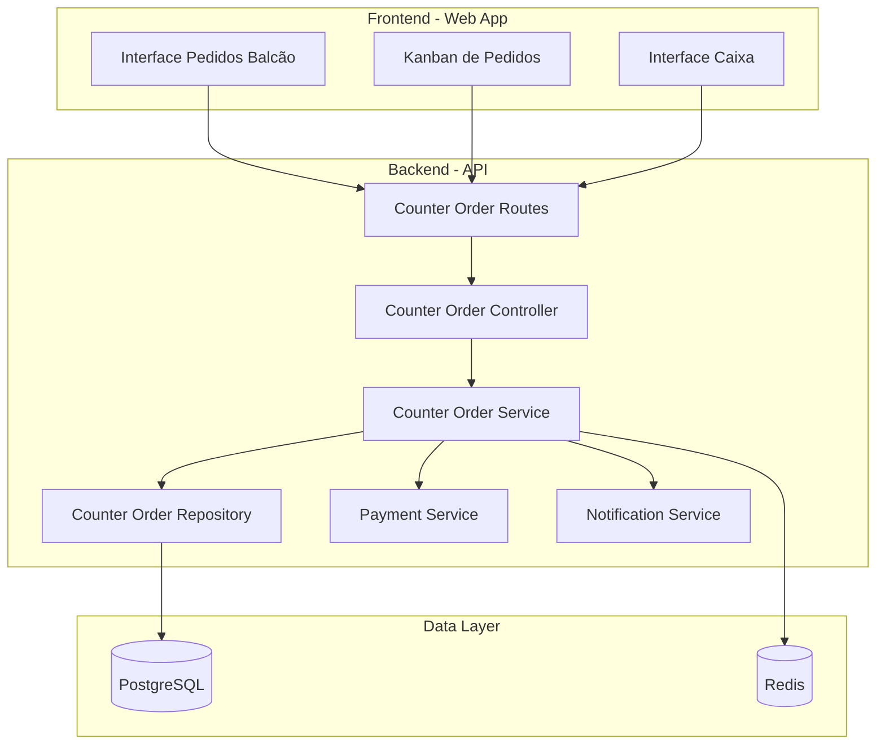
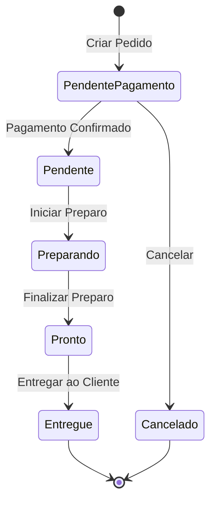
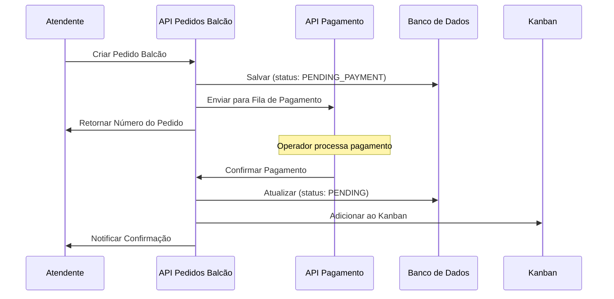

# Documento de Design - Sistema de Pedidos Balcão

## Visão Geral

O Sistema de Pedidos Balcão é um módulo que permite criar e gerenciar pedidos sem vinculação a mesas, com pagamento obrigatório antes da preparação. O sistema integra-se com o módulo de Caixa para processamento de pagamentos e com o Kanban de Pedidos para visualização da cozinha.

### Objetivos do Design

- Criar fluxo simplificado para pedidos rápidos no balcão
- Garantir pagamento antes da preparação
- Integrar com sistemas existentes (Caixa e Kanban)
- Fornecer rastreamento eficiente de pedidos
- Manter performance e escalabilidade

## Arquitetura

### Diagrama de Componentes



### Fluxo de Estados do Pedido



### Fluxo de Integração com Caixa



## Componentes e Interfaces

### 1. Modelo de Dados

#### Schema Prisma - CounterOrder

```prisma
model CounterOrder {
  id                String              @id @default(uuid())
  orderNumber       Int                 @unique @default(autoincrement())
  customerName      String?             @db.VarChar(100)
  status            CounterOrderStatus  @default(PENDING_PAYMENT)
  totalAmount       Decimal             @db.Decimal(10, 2)
  notes             String?             @db.VarChar(500)
  cancellationReason String?            @db.VarChar(200)
  
  // Timestamps
  createdAt         DateTime            @default(now())
  paidAt            DateTime?
  startedAt         DateTime?
  readyAt           DateTime?
  deliveredAt       DateTime?
  cancelledAt       DateTime?
  
  // Relações
  items             CounterOrderItem[]
  payment           Payment?
  establishmentId   String
  establishment     Establishment       @relation(fields: [establishmentId], references: [id])
  createdById       String
  createdBy         User                @relation(fields: [createdById], references: [id])
  
  @@index([establishmentId, status])
  @@index([orderNumber])
  @@index([createdAt])
  @@map("counter_orders")
}

model CounterOrderItem {
  id              String       @id @default(uuid())
  quantity        Int
  unitPrice       Decimal      @db.Decimal(10, 2)
  totalPrice      Decimal      @db.Decimal(10, 2)
  notes           String?      @db.VarChar(200)
  
  // Relações
  counterOrderId  String
  counterOrder    CounterOrder @relation(fields: [counterOrderId], references: [id], onDelete: Cascade)
  productId       String
  product         Product      @relation(fields: [productId], references: [id])
  
  @@index([counterOrderId])
  @@map("counter_order_items")
}

enum CounterOrderStatus {
  AGUARDANDO_PAGAMENTO  // Aguardando pagamento
  PENDENTE              // Pago, aguardando preparo
  PREPARANDO            // Em preparação
  PRONTO                // Pronto para retirada
  ENTREGUE              // Entregue ao cliente
  CANCELADO             // Cancelado
}
```

### 2. DTOs e Schemas de Validação

#### CreateCounterOrderDTO

```typescript
import { z } from 'zod';

export const CreateCounterOrderItemSchema = z.object({
  productId: z.string().uuid(),
  quantity: z.number().int().min(1).max(99),
  notes: z.string().max(200).optional(),
});

export const CreateCounterOrderSchema = z.object({
  customerName: z.string().max(100).optional(),
  notes: z.string().max(500).optional(),
  items: z.array(CreateCounterOrderItemSchema).min(1),
});

export type CreateCounterOrderDTO = z.infer<typeof CreateCounterOrderSchema>;
export type CreateCounterOrderItemDTO = z.infer<typeof CreateCounterOrderItemSchema>;
```

#### UpdateCounterOrderStatusDTO

```typescript
export const UpdateCounterOrderStatusSchema = z.object({
  status: z.enum(['PENDENTE', 'PREPARANDO', 'PRONTO', 'ENTREGUE']),
});

export type UpdateCounterOrderStatusDTO = z.infer<typeof UpdateCounterOrderStatusSchema>;
```

#### CancelCounterOrderDTO

```typescript
export const CancelCounterOrderSchema = z.object({
  reason: z.string().min(1).max(200),
});

export type CancelCounterOrderDTO = z.infer<typeof CancelCounterOrderSchema>;
```

#### CounterOrderResponseDTO

```typescript
export interface CounterOrderItemResponse {
  id: string;
  productId: string;
  productName: string;
  quantity: number;
  unitPrice: number;
  totalPrice: number;
  notes?: string;
}

export interface CounterOrderResponse {
  id: string;
  orderNumber: number;
  customerName?: string;
  status: CounterOrderStatus;
  totalAmount: number;
  notes?: string;
  items: CounterOrderItemResponse[];
  createdAt: string;
  paidAt?: string;
  readyAt?: string;
  deliveredAt?: string;
  createdBy: {
    id: string;
    name: string;
  };
}
```

### 3. Camada de Repositório

#### CounterOrderRepository

```typescript
export interface ICounterOrderRepository {
  // Criação
  create(data: CreateCounterOrderData): Promise<CounterOrder>;
  
  // Consultas
  findById(id: string, establishmentId: string): Promise<CounterOrder | null>;
  findByOrderNumber(orderNumber: number, establishmentId: string): Promise<CounterOrder | null>;
  findPendingPayment(establishmentId: string): Promise<CounterOrder[]>;
  findByStatus(status: CounterOrderStatus, establishmentId: string): Promise<CounterOrder[]>;
  findActiveOrders(establishmentId: string): Promise<CounterOrder[]>;
  
  // Atualizações
  updateStatus(id: string, status: CounterOrderStatus, timestamp?: Date): Promise<CounterOrder>;
  markAsPaid(id: string, paymentId: string): Promise<CounterOrder>;
  cancel(id: string, reason: string): Promise<CounterOrder>;
  
  // Métricas
  getMetrics(establishmentId: string, startDate: Date, endDate: Date): Promise<CounterOrderMetrics>;
  getAveragePreparationTime(establishmentId: string, days: number): Promise<number>;
}

export interface CreateCounterOrderData {
  customerName?: string;
  notes?: string;
  totalAmount: number;
  items: CreateCounterOrderItemData[];
  establishmentId: string;
  createdById: string;
}

export interface CreateCounterOrderItemData {
  productId: string;
  quantity: number;
  unitPrice: number;
  totalPrice: number;
  notes?: string;
}

export interface CounterOrderMetrics {
  totalOrders: number;
  totalRevenue: number;
  averageOrderValue: number;
  averagePaymentTime: number;
  averagePreparationTime: number;
  ordersByStatus: Record<CounterOrderStatus, number>;
}
```

### 4. Camada de Serviço

#### CounterOrderService

```typescript
export interface ICounterOrderService {
  // Operações principais
  createOrder(dto: CreateCounterOrderDTO, userId: string, establishmentId: string): Promise<CounterOrderResponse>;
  getOrderById(id: string, establishmentId: string): Promise<CounterOrderResponse>;
  getOrderByNumber(orderNumber: number, establishmentId: string): Promise<CounterOrderResponse>;
  
  // Gestão de status
  updateOrderStatus(id: string, status: CounterOrderStatus, establishmentId: string): Promise<CounterOrderResponse>;
  confirmPayment(id: string, paymentId: string, establishmentId: string): Promise<CounterOrderResponse>;
  cancelOrder(id: string, reason: string, establishmentId: string): Promise<void>;
  
  // Listagens
  getPendingPaymentOrders(establishmentId: string): Promise<CounterOrderResponse[]>;
  getActiveOrders(establishmentId: string): Promise<CounterOrderResponse[]>;
  getReadyOrders(establishmentId: string): Promise<CounterOrderResponse[]>;
  
  // Métricas
  getMetrics(establishmentId: string, startDate: Date, endDate: Date): Promise<CounterOrderMetrics>;
}
```

**Regras de Negócio Implementadas no Service:**

1. **Validação de Produtos**: Verificar se todos os produtos existem e estão ativos
2. **Cálculo de Valores**: Calcular preços unitários e total do pedido
3. **Validação de Status**: Garantir transições válidas de status
4. **Integração com Pagamento**: Enviar pedido para fila de pagamento
5. **Notificações**: Emitir eventos quando pedido muda de status
6. **Cache**: Armazenar pedidos ativos em Redis para acesso rápido
7. **Validação de Cancelamento**: Impedir cancelamento de pedidos pagos

### 5. Camada de Controller

#### CounterOrderController

```typescript
export class CounterOrderController {
  // POST /api/v1/counter-orders
  async create(req: Request, res: Response): Promise<void>;
  
  // GET /api/v1/counter-orders/:id
  async getById(req: Request, res: Response): Promise<void>;
  
  // GET /api/v1/counter-orders/number/:orderNumber
  async getByNumber(req: Request, res: Response): Promise<void>;
  
  // GET /api/v1/counter-orders
  async list(req: Request, res: Response): Promise<void>;
  
  // GET /api/v1/counter-orders/pending-payment
  async listPendingPayment(req: Request, res: Response): Promise<void>;
  
  // GET /api/v1/counter-orders/ready
  async listReady(req: Request, res: Response): Promise<void>;
  
  // PATCH /api/v1/counter-orders/:id/status
  async updateStatus(req: Request, res: Response): Promise<void>;
  
  // POST /api/v1/counter-orders/:id/cancel
  async cancel(req: Request, res: Response): Promise<void>;
  
  // GET /api/v1/counter-orders/metrics
  async getMetrics(req: Request, res: Response): Promise<void>;
}
```

### 6. Rotas da API

```typescript
// /api/v1/counter-orders

POST   /                          - Criar pedido balcão
GET    /                          - Listar pedidos ativos
GET    /:id                       - Buscar pedido por ID
GET    /number/:orderNumber       - Buscar pedido por número
GET    /pending-payment           - Listar pedidos pendentes de pagamento
GET    /ready                     - Listar pedidos prontos
PATCH  /:id/status                - Atualizar status do pedido
POST   /:id/cancel                - Cancelar pedido
GET    /metrics                   - Obter métricas
```

**Middlewares Aplicados:**
- `authenticate` - Todas as rotas
- `authorize(['GARCOM', 'CAIXA', 'GERENTE'])` - Criar e listar
- `authorize(['GERENTE'])` - Cancelar e métricas
- `validateEstablishment` - Todas as rotas

## Integração com Sistemas Existentes

### 1. Integração com Módulo de Caixa

#### PaymentQueueService

```typescript
export interface IPaymentQueueService {
  // Adicionar pedido à fila de pagamento
  addToPaymentQueue(order: CounterOrder): Promise<void>;
  
  // Remover pedido da fila (cancelamento)
  removeFromPaymentQueue(orderId: string): Promise<void>;
  
  // Callback de confirmação de pagamento
  onPaymentConfirmed(orderId: string, paymentId: string): Promise<void>;
}
```

**Implementação:**
- Usar Redis para fila de pagamentos pendentes
- Chave: `pagamento:fila:{establishmentId}`
- Estrutura: Sorted Set com score = timestamp de criação
- TTL: 24 horas para limpeza automática

### 2. Integração com Kanban de Pedidos

#### KanbanIntegrationService

```typescript
export interface IKanbanIntegrationService {
  // Adicionar pedido ao Kanban após pagamento
  addToKanban(order: CounterOrder): Promise<void>;
  
  // Atualizar posição no Kanban
  updateKanbanStatus(orderId: string, status: CounterOrderStatus): Promise<void>;
  
  // Remover do Kanban (entregue ou cancelado)
  removeFromKanban(orderId: string): Promise<void>;
}
```

**Implementação:**
- Usar WebSocket para atualizações em tempo real
- Evento: `kanban:pedido:adicionado`, `kanban:pedido:atualizado`, `kanban:pedido:removido`
- Payload inclui flag `isPedidoBalcao: true`

### 3. Sistema de Notificações

#### NotificationService

```typescript
export interface INotificationService {
  // Notificar mudança de status
  notifyStatusChange(order: CounterOrder, newStatus: CounterOrderStatus): Promise<void>;
  
  // Notificar pedido pronto
  notifyOrderReady(order: CounterOrder): Promise<void>;
  
  // Notificar pedido atrasado
  notifyOrderDelayed(order: CounterOrder, delayMinutes: number): Promise<void>;
}
```

**Canais de Notificação:**
- WebSocket para interface web
- Push notifications (futuro)
- Display de chamada de pedidos (futuro)

## Tratamento de Erros

### Erros Específicos do Domínio

```typescript
export class CounterOrderError extends Error {
  constructor(message: string, public code: string) {
    super(message);
    this.name = 'CounterOrderError';
  }
}

// Erros específicos
export class OrderNotFoundError extends CounterOrderError {
  constructor(identifier: string) {
    super(`Pedido não encontrado: ${identifier}`, 'ORDER_NOT_FOUND');
  }
}

export class InvalidStatusTransitionError extends CounterOrderError {
  constructor(from: string, to: string) {
    super(`Transição de status inválida: ${from} -> ${to}`, 'INVALID_STATUS_TRANSITION');
  }
}

export class OrderAlreadyPaidError extends CounterOrderError {
  constructor(orderId: string) {
    super(`Pedido já foi pago: ${orderId}`, 'ORDER_ALREADY_PAID');
  }
}

export class ProductUnavailableError extends CounterOrderError {
  constructor(productName: string) {
    super(`Produto indisponível: ${productName}`, 'PRODUCT_UNAVAILABLE');
  }
}

export class CannotCancelPaidOrderError extends CounterOrderError {
  constructor(orderId: string) {
    super(`Não é possível cancelar pedido pago: ${orderId}`, 'CANNOT_CANCEL_PAID_ORDER');
  }
}
```

### Estratégias de Tratamento

1. **Validação de Entrada**: Usar Zod schemas para validar DTOs
2. **Validação de Negócio**: Lançar erros específicos do domínio
3. **Middleware de Erro**: Capturar e formatar erros para resposta HTTP
4. **Logging**: Registrar erros com contexto completo
5. **Rollback**: Usar transações do Prisma para operações críticas

## Estratégia de Cache

### Redis Cache Strategy

```typescript
// Chaves de cache
const CACHE_KEYS = {
  pedidosAtivos: (establishmentId: string) => `balcao:ativos:${establishmentId}`,
  pedidoPorId: (orderId: string) => `balcao:pedido:${orderId}`,
  pedidoPorNumero: (establishmentId: string, orderNumber: number) => 
    `balcao:pedido:${establishmentId}:${orderNumber}`,
  pedidosProntos: (establishmentId: string) => `balcao:prontos:${establishmentId}`,
  metricas: (establishmentId: string, date: string) => `balcao:metricas:${establishmentId}:${date}`,
};

// TTLs
const CACHE_TTL = {
  pedidosAtivos: 60, // 1 minuto
  pedidoPorId: 300, // 5 minutos
  pedidosProntos: 30, // 30 segundos
  metricas: 3600, // 1 hora
};
```

**Estratégia de Invalidação:**
- Invalidar cache ao criar pedido
- Invalidar cache ao atualizar status
- Invalidar cache ao cancelar pedido
- Usar padrão Cache-Aside para leituras

## Estratégia de Testes

### 1. Testes Unitários

**CounterOrderService:**
- Criar pedido com itens válidos
- Validar produtos indisponíveis
- Calcular valores corretamente
- Validar transições de status
- Impedir cancelamento de pedidos pagos

**CounterOrderRepository:**
- CRUD operations
- Queries com filtros
- Cálculo de métricas

### 2. Testes de Integração

**API Endpoints:**
- POST /counter-orders - criar pedido
- PATCH /counter-orders/:id/status - atualizar status
- POST /counter-orders/:id/cancel - cancelar pedido
- GET /counter-orders/pending-payment - listar pendentes

**Integração com Caixa:**
- Adicionar à fila de pagamento
- Confirmar pagamento
- Remover da fila ao cancelar

**Integração com Kanban:**
- Adicionar ao Kanban após pagamento
- Atualizar status no Kanban
- Remover do Kanban ao entregar

### 3. Testes E2E

**Fluxo Completo:**
1. Criar pedido balcão
2. Processar pagamento
3. Visualizar no Kanban
4. Atualizar status até entrega
5. Verificar métricas

## Performance e Escalabilidade

### Otimizações

1. **Índices de Banco de Dados:**
   - `(establishmentId, status)` - Listagens por status
   - `orderNumber` - Busca por número
   - `createdAt` - Ordenação temporal

2. **Cache de Leitura:**
   - Pedidos ativos em Redis
   - Métricas diárias em cache
   - TTL configurável por tipo de dado

3. **Paginação:**
   - Implementar cursor-based pagination para listagens
   - Limite padrão: 50 pedidos por página

4. **Queries Otimizadas:**
   - Usar `select` para buscar apenas campos necessários
   - Usar `include` com cuidado para evitar N+1
   - Implementar eager loading para relações frequentes

### Limites e Quotas

- Máximo de 99 unidades por item
- Máximo de 50 itens por pedido
- Máximo de 200 caracteres para observações de item
- Máximo de 500 caracteres para observações do pedido
- Rate limiting: 100 requisições por minuto por usuário

## Segurança

### Controle de Acesso

```typescript
// Permissões por role
const PERMISSOES = {
  GARCOM: ['criar', 'ler', 'atualizarStatus'],
  CAIXA: ['ler', 'confirmarPagamento'],
  GERENTE: ['criar', 'ler', 'atualizarStatus', 'cancelar', 'metricas'],
  ADMIN: ['*'],
};
```

### Validações de Segurança

1. **Isolamento por Estabelecimento**: Todos os queries filtram por `establishmentId`
2. **Validação de Propriedade**: Verificar se pedido pertence ao estabelecimento
3. **Auditoria**: Registrar usuário que criou/modificou pedido
4. **Rate Limiting**: Limitar requisições por usuário
5. **Input Sanitization**: Validar e sanitizar todas as entradas

## Monitoramento e Observabilidade

### Métricas a Monitorar

1. **Performance:**
   - Tempo de resposta das APIs
   - Tempo de processamento de pagamento
   - Tempo médio de preparação

2. **Negócio:**
   - Número de pedidos por hora
   - Taxa de cancelamento
   - Valor médio do pedido
   - Pedidos atrasados (>5min prontos)

3. **Erros:**
   - Taxa de erro por endpoint
   - Produtos indisponíveis
   - Falhas de integração com Caixa

### Logging

```typescript
// Eventos a logar
logger.info('Pedido balcão criado', {
  pedidoId: orderId,
  numeroPedido: orderNumber,
  valorTotal: totalAmount,
  quantidadeItens: itemCount,
  usuarioId: userId,
  estabelecimentoId: establishmentId,
});

logger.info('Status do pedido balcão alterado', {
  pedidoId: orderId,
  statusAnterior: oldStatus,
  novoStatus: newStatus,
  usuarioId: userId,
});

logger.warn('Pedido balcão atrasado', {
  pedidoId: orderId,
  numeroPedido: orderNumber,
  minutosAtraso: delayMinutes,
});

logger.error('Falha ao processar pagamento', {
  pedidoId: orderId,
  erro: error,
});
```

## Considerações Futuras

### Melhorias Planejadas

1. **Impressão de Comprovantes:**
   - Gerar PDF com número do pedido
   - Integração com impressoras térmicas

2. **Display de Chamada:**
   - Tela para exibir números de pedidos prontos
   - Integração com sistema de som

3. **Agendamento de Pedidos:**
   - Permitir agendar pedido para horário futuro
   - Notificar cliente quando próximo do horário

4. **Programa de Fidelidade:**
   - Acumular pontos por pedido
   - Descontos para clientes frequentes

5. **Integração com Delivery:**
   - Suporte para pedidos de delivery
   - Rastreamento de entregadores

6. **Analytics Avançado:**
   - Produtos mais vendidos no balcão
   - Horários de pico
   - Previsão de demanda

