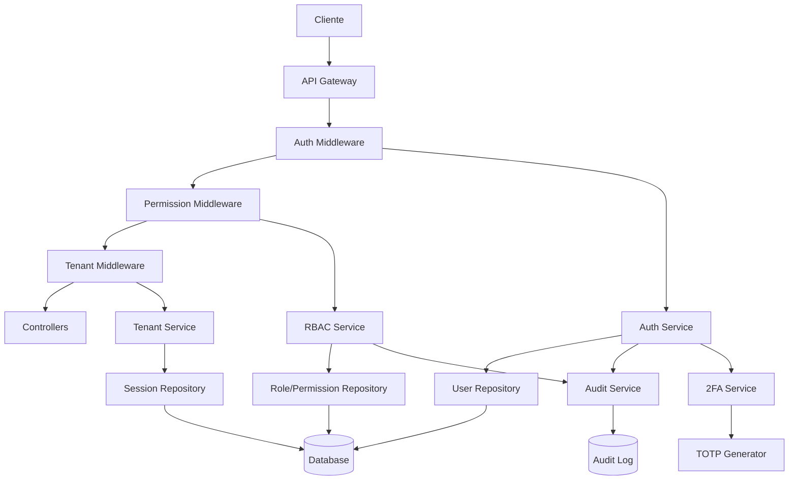

# Sistema de Controle de Acesso - Documento de Design

## 1. Visão Geral

O Sistema de Controle de Acesso é um módulo fundamental que implementa RBAC (Role-Based Access Control) para gerenciar autenticação, autorização e segmentação de acesso em todo o sistema. Garante que cada usuário tenha acesso apenas às funcionalidades apropriadas ao seu papel.

### 1.1 Objetivos

- Implementar autenticação segura com JWT e 2FA
- Gerenciar funções e permissões granulares
- Garantir isolamento de dados entre estabelecimentos (multi-tenancy)
- Registrar auditoria completa de todas as ações
- Suportar 10 tipos diferentes de usuários
- Conformidade com LGPD

### 1.2 Escopo

**Incluído:**
- Autenticação e autorização
- Gestão de usuários, funções e permissões
- Multi-tenancy com isolamento de dados
- Auditoria e logs de segurança
- Gestão de sessões
- 2FA (Two-Factor Authentication)
- Recuperação de senha
- Notificações de segurança

**Não Incluído:**
- Integração com provedores OAuth externos (Google, Facebook)
- Biometria
- Single Sign-On (SSO) corporativo

## 2. Arquitetura

### 2.1 Arquitetura do Sistema

```
┌─────────────────────────────────────────────────────────────┐
│              SISTEMA DE CONTROLE DE ACESSO                   │
├─────────────────────────────────────────────────────────────┤
│                                                               │
│  ┌──────────────┐  ┌──────────────┐  ┌──────────────┐      │
│  │     Auth     │  │     RBAC     │  │   Session    │      │
│  │   Manager    │◄─┤   Manager    │─►│   Manager    │      │
│  └──────┬───────┘  └──────────────┘  └──────────────┘      │
│         │                                                     │
│         ├──────────────┬──────────────┬──────────────┐      │
│         ▼              ▼              ▼              ▼      │
│  ┌──────────┐  ┌──────────┐  ┌──────────┐  ┌──────────┐   │
│  │   Login  │  │   2FA    │  │  Audit   │  │  Multi   │   │
│  │ Service  │  │ Service  │  │ Service  │  │ Tenancy  │   │
│  └──────────┘  └──────────┘  └──────────┘  └──────────┘   │
│                                                               │
└─────────────────────────────────────────────────────────────┘
                            │
                            ▼
┌─────────────────────────────────────────────────────────────┐
│                    CAMADA DE MIDDLEWARE                      │
├─────────────────────────────────────────────────────────────┤
│  Auth Middleware  │  Permission Check  │  Tenant Isolation  │
└─────────────────────────────────────────────────────────────┘
```

### 2.2 Diagrama de Componentes




## 3. Componentes e Interfaces

### 3.1 Auth Manager

**Responsabilidades:**
- Gerenciar autenticação de usuários
- Gerar e validar tokens JWT
- Controlar tentativas de login
- Gerenciar bloqueio de contas

**Interface:**
```typescript
interface IAuthManager {
  login(credentials: LoginDTO): Promise<AuthResponse>
  logout(userId: string, sessionId: string): Promise<void>
  validateToken(token: string): Promise<TokenPayload>
  refreshToken(refreshToken: string): Promise<AuthResponse>
  resetPassword(token: string, newPassword: string): Promise<void>
  requestPasswordReset(email: string): Promise<void>
}
```

### 3.2 RBAC Manager

**Responsabilidades:**
- Gerenciar funções e permissões
- Verificar permissões de usuários
- Implementar hierarquia de funções
- Gerenciar delegação de permissões

**Interface:**
```typescript
interface IRBACManager {
  checkPermission(userId: string, permission: string): Promise<boolean>
  getUserPermissions(userId: string): Promise<string[]>
  assignRole(userId: string, roleId: string): Promise<void>
  removeRole(userId: string, roleId: string): Promise<void>
  createRole(data: CreateRoleDTO): Promise<Role>
  updateRole(roleId: string, data: UpdateRoleDTO): Promise<Role>
  deleteRole(roleId: string): Promise<void>
  delegatePermission(data: DelegatePermissionDTO): Promise<DelegatedPermission>
}
```

### 3.3 Session Manager

**Responsabilidades:**
- Gerenciar sessões ativas
- Rastrear dispositivos e localizações
- Permitir encerramento remoto de sessões
- Limpar sessões expiradas

**Interface:**
```typescript
interface ISessionManager {
  createSession(userId: string, deviceInfo: DeviceInfo): Promise<Session>
  getActiveSessions(userId: string): Promise<Session[]>
  terminateSession(sessionId: string): Promise<void>
  terminateAllSessions(userId: string, exceptCurrent?: string): Promise<void>
  cleanExpiredSessions(): Promise<number>
}
```

### 3.4 2FA Service

**Responsabilidades:**
- Gerar segredos TOTP
- Validar códigos 2FA
- Gerenciar códigos de backup
- Gerar QR codes

**Interface:**
```typescript
interface I2FAService {
  enable2FA(userId: string): Promise<{ secret: string, qrCode: string, backupCodes: string[] }>
  disable2FA(userId: string, code: string): Promise<void>
  verify2FACode(userId: string, code: string): Promise<boolean>
  regenerateBackupCodes(userId: string): Promise<string[]>
  useBackupCode(userId: string, code: string): Promise<boolean>
}
```

### 3.5 Audit Service

**Responsabilidades:**
- Registrar todas as ações de usuários
- Armazenar logs imutáveis
- Permitir busca e filtros
- Gerar relatórios de auditoria

**Interface:**
```typescript
interface IAuditService {
  log(action: AuditAction): Promise<void>
  getAuditTrail(filters: AuditFilters): Promise<PaginatedResult<AuditLog>>
  getUserActions(userId: string, period: Period): Promise<AuditLog[]>
  getResourceHistory(resourceType: string, resourceId: string): Promise<AuditLog[]>
  generateAuditReport(filters: AuditFilters): Promise<AuditReport>
}
```

### 3.6 Tenant Service

**Responsabilidades:**
- Garantir isolamento de dados
- Validar acesso entre estabelecimentos
- Gerenciar contexto de tenant
- Registrar violações de isolamento

**Interface:**
```typescript
interface ITenantService {
  validateTenantAccess(userId: string, tenantId: string): Promise<boolean>
  getCurrentTenant(userId: string): Promise<string>
  switchTenant(userId: string, tenantId: string): Promise<void>
  addTenantFilter<T>(query: Query<T>, tenantId: string): Query<T>
}
```

## 4. Modelos de Dados

### 4.1 Schema do Banco de Dados

```prisma
model User {
  id                    String    @id @default(uuid())
  email                 String
  password              String
  name                  String
  phone                 String?
  photo                 String?
  establishmentId       String
  isActive              Boolean   @default(true)
  emailVerified         Boolean   @default(false)
  emailVerificationToken String?
  twoFactorEnabled      Boolean   @default(false)
  twoFactorSecret       String?
  backupCodes           String[]
  failedLoginAttempts   Int       @default(0)
  lockedUntil           DateTime?
  lastLoginAt           DateTime?
  lastLoginIp           String?
  lastLoginUserAgent    String?
  passwordResetToken    String?
  passwordResetExpires  DateTime?
  createdAt             DateTime  @default(now())
  updatedAt             DateTime  @updatedAt
  
  establishment         Establishment @relation(fields: [establishmentId], references: [id])
  roles                 UserRole[]
  sessions              Session[]
  auditLogs             AuditLog[]
  delegatedPermissions  DelegatedPermission[]
  
  @@unique([email, establishmentId])
  @@index([establishmentId])
  @@index([email])
  @@map("users")
}

model Role {
  id              String    @id @default(uuid())
  name            String
  description     String?
  isSystem        Boolean   @default(false)
  parentRoleId    String?
  establishmentId String?
  createdAt       DateTime  @default(now())
  updatedAt       DateTime  @updatedAt
  
  parentRole      Role?     @relation("RoleHierarchy", fields: [parentRoleId], references: [id])
  childRoles      Role[]    @relation("RoleHierarchy")
  establishment   Establishment? @relation(fields: [establishmentId], references: [id])
  permissions     RolePermission[]
  users           UserRole[]
  
  @@unique([name, establishmentId])
  @@index([establishmentId])
  @@map("roles")
}

model Permission {
  id          String    @id @default(uuid())
  resource    String
  action      String
  description String?
  conditions  Json?
  createdAt   DateTime  @default(now())
  
  roles       RolePermission[]
  
  @@unique([resource, action])
  @@map("permissions")
}

model UserRole {
  id        String   @id @default(uuid())
  userId    String
  roleId    String
  createdAt DateTime @default(now())
  
  user      User     @relation(fields: [userId], references: [id], onDelete: Cascade)
  role      Role     @relation(fields: [roleId], references: [id], onDelete: Cascade)
  
  @@unique([userId, roleId])
  @@index([userId])
  @@index([roleId])
  @@map("user_roles")
}

model RolePermission {
  id           String     @id @default(uuid())
  roleId       String
  permissionId String
  createdAt    DateTime   @default(now())
  
  role         Role       @relation(fields: [roleId], references: [id], onDelete: Cascade)
  permission   Permission @relation(fields: [permissionId], references: [id], onDelete: Cascade)
  
  @@unique([roleId, permissionId])
  @@index([roleId])
  @@index([permissionId])
  @@map("role_permissions")
}

model DelegatedPermission {
  id           String     @id @default(uuid())
  userId       String
  permissionId String
  delegatedBy  String
  expiresAt    DateTime
  reason       String?
  createdAt    DateTime   @default(now())
  
  user         User       @relation(fields: [userId], references: [id], onDelete: Cascade)
  
  @@index([userId])
  @@index([expiresAt])
  @@map("delegated_permissions")
}

model Session {
  id         String    @id @default(uuid())
  userId     String
  token      String    @unique
  device     String?
  browser    String?
  os         String?
  ipAddress  String
  location   String?
  expiresAt  DateTime
  createdAt  DateTime  @default(now())
  lastActiveAt DateTime @default(now())
  
  user       User      @relation(fields: [userId], references: [id], onDelete: Cascade)
  
  @@index([userId])
  @@index([token])
  @@index([expiresAt])
  @@map("sessions")
}

model AuditLog {
  id            String   @id @default(uuid())
  userId        String?
  action        String
  resource      String
  resourceId    String?
  previousState Json?
  newState      Json?
  ipAddress     String
  userAgent     String?
  timestamp     DateTime @default(now())
  
  user          User?    @relation(fields: [userId], references: [id], onDelete: SetNull)
  
  @@index([userId])
  @@index([resource, resourceId])
  @@index([timestamp])
  @@map("audit_logs")
}
```

### 4.2 DTOs (Data Transfer Objects)

```typescript
// Authentication
interface LoginDTO {
  email: string
  password: string
  twoFactorCode?: string
}

interface AuthResponse {
  success: boolean
  token: string
  refreshToken: string
  user: UserDTO
  requiresTwoFactor?: boolean
}

interface TokenPayload {
  userId: string
  email: string
  establishmentId: string
  roles: string[]
  permissions: string[]
  iat: number
  exp: number
}

// User Management
interface CreateUserDTO {
  email: string
  password: string
  name: string
  phone?: string
  establishmentId: string
  roleIds: string[]
}

interface UpdateUserDTO {
  name?: string
  phone?: string
  photo?: string
}

interface ChangePasswordDTO {
  currentPassword: string
  newPassword: string
}

// Role Management
interface CreateRoleDTO {
  name: string
  description?: string
  parentRoleId?: string
  permissionIds: string[]
  establishmentId?: string
}

interface UpdateRoleDTO {
  name?: string
  description?: string
  permissionIds?: string[]
}

// Permission Delegation
interface DelegatePermissionDTO {
  userId: string
  permissionId: string
  expiresAt: Date
  reason?: string
}

// Audit
interface AuditFilters {
  userId?: string
  action?: string
  resource?: string
  resourceId?: string
  startDate?: Date
  endDate?: Date
  page?: number
  limit?: number
}
```


## 5. Lógica de Negócio

### 5.1 Fluxo de Autenticação

```typescript
async login(credentials: LoginDTO): Promise<AuthResponse> {
  // 1. Buscar usuário por email e estabelecimento
  const user = await this.userRepository.findByEmail(credentials.email)
  if (!user || !user.isActive) {
    throw new AuthenticationError('Credenciais inválidas')
  }
  
  // 2. Verificar se conta está bloqueada
  if (user.lockedUntil && user.lockedUntil > new Date()) {
    throw new AccountLockedError('Conta bloqueada temporariamente')
  }
  
  // 3. Validar senha
  const isValidPassword = await bcrypt.compare(credentials.password, user.password)
  if (!isValidPassword) {
    await this.incrementFailedAttempts(user.id)
    throw new AuthenticationError('Credenciais inválidas')
  }
  
  // 4. Verificar 2FA se habilitado
  if (user.twoFactorEnabled) {
    if (!credentials.twoFactorCode) {
      return { success: false, requiresTwoFactor: true }
    }
    
    const isValid2FA = await this.twoFactorService.verify(user.id, credentials.twoFactorCode)
    if (!isValid2FA) {
      throw new AuthenticationError('Código 2FA inválido')
    }
  }
  
  // 5. Resetar tentativas falhas
  await this.userRepository.update(user.id, {
    failedLoginAttempts: 0,
    lastLoginAt: new Date(),
    lastLoginIp: this.getClientIp(),
    lastLoginUserAgent: this.getUserAgent()
  })
  
  // 6. Gerar tokens
  const permissions = await this.rbacService.getUserPermissions(user.id)
  const token = this.generateJWT(user, permissions)
  const refreshToken = this.generateRefreshToken(user.id)
  
  // 7. Criar sessão
  await this.sessionManager.createSession(user.id, this.getDeviceInfo())
  
  // 8. Registrar auditoria
  await this.auditService.log({
    userId: user.id,
    action: 'USER_LOGIN',
    resource: 'auth',
    ipAddress: this.getClientIp()
  })
  
  // 9. Notificar se novo dispositivo
  if (await this.isNewDevice(user.id)) {
    await this.notificationService.sendNewDeviceAlert(user.email)
  }
  
  return {
    success: true,
    token,
    refreshToken,
    user: this.toUserDTO(user)
  }
}
```

### 5.2 Verificação de Permissões

```typescript
async checkPermission(userId: string, permission: string): Promise<boolean> {
  // 1. Buscar permissões do cache
  const cacheKey = `permissions:${userId}`
  let permissions = await this.cache.get<string[]>(cacheKey)
  
  if (!permissions) {
    // 2. Buscar do banco de dados
    permissions = await this.getUserPermissions(userId)
    
    // 3. Cachear por 5 minutos
    await this.cache.set(cacheKey, permissions, 300)
  }
  
  // 4. Verificar permissão exata
  if (permissions.includes(permission)) {
    return true
  }
  
  // 5. Verificar permissão wildcard (ex: products:* inclui products:create)
  const [resource, action] = permission.split(':')
  if (permissions.includes(`${resource}:*`)) {
    return true
  }
  
  // 6. Verificar permissão global
  if (permissions.includes('*:*')) {
    return true
  }
  
  return false
}

async getUserPermissions(userId: string): Promise<string[]> {
  // 1. Buscar funções do usuário
  const userRoles = await this.userRoleRepository.findByUserId(userId)
  
  // 2. Buscar permissões de cada função (incluindo hierarquia)
  const allPermissions = new Set<string>()
  
  for (const userRole of userRoles) {
    const rolePermissions = await this.getRolePermissionsRecursive(userRole.roleId)
    rolePermissions.forEach(p => allPermissions.add(p))
  }
  
  // 3. Buscar permissões delegadas não expiradas
  const delegated = await this.delegatedPermissionRepository.findActive(userId)
  delegated.forEach(d => allPermissions.add(d.permission))
  
  return Array.from(allPermissions)
}

async getRolePermissionsRecursive(roleId: string): Promise<string[]> {
  const permissions = new Set<string>()
  
  // Buscar permissões da função
  const rolePerms = await this.rolePermissionRepository.findByRoleId(roleId)
  rolePerms.forEach(p => permissions.add(`${p.resource}:${p.action}`))
  
  // Buscar permissões da função pai (hierarquia)
  const role = await this.roleRepository.findById(roleId)
  if (role.parentRoleId) {
    const parentPerms = await this.getRolePermissionsRecursive(role.parentRoleId)
    parentPerms.forEach(p => permissions.add(p))
  }
  
  return Array.from(permissions)
}
```

### 5.3 Isolamento Multi-tenant

```typescript
// Middleware para adicionar filtro de tenant automaticamente
class TenantMiddleware {
  async use(req: Request, res: Response, next: NextFunction) {
    const user = req.user
    
    if (!user) {
      return next()
    }
    
    // Super admin pode acessar qualquer tenant
    if (user.roles.includes('SUPER_ADMIN')) {
      return next()
    }
    
    // Adicionar filtro de tenant em todas as queries
    req.tenantId = user.establishmentId
    
    // Validar se está tentando acessar outro tenant
    if (req.body.establishmentId && req.body.establishmentId !== user.establishmentId) {
      await this.auditService.log({
        userId: user.id,
        action: 'TENANT_VIOLATION_ATTEMPT',
        resource: 'security',
        details: { attemptedTenant: req.body.establishmentId }
      })
      
      throw new ForbiddenError('Acesso negado a outro estabelecimento')
    }
    
    next()
  }
}

// Interceptor do Prisma para adicionar filtro automático
prisma.$use(async (params, next) => {
  // Modelos que precisam de filtro de tenant
  const tenantModels = ['Product', 'Category', 'Sale', 'CashSession', 'User']
  
  if (tenantModels.includes(params.model)) {
    if (params.action === 'findMany' || params.action === 'findFirst') {
      params.args.where = {
        ...params.args.where,
        establishmentId: getCurrentTenantId()
      }
    }
    
    if (params.action === 'create' || params.action === 'createMany') {
      if (Array.isArray(params.args.data)) {
        params.args.data = params.args.data.map(item => ({
          ...item,
          establishmentId: getCurrentTenantId()
        }))
      } else {
        params.args.data = {
          ...params.args.data,
          establishmentId: getCurrentTenantId()
        }
      }
    }
  }
  
  return next(params)
})
```

## 6. Endpoints da API

### 6.1 Autenticação

```typescript
// Login
POST /api/v1/auth/login
Body: { email, password, twoFactorCode? }
Response: { token, refreshToken, user }

// Logout
POST /api/v1/auth/logout
Headers: Authorization: Bearer {token}
Response: { success: true }

// Refresh Token
POST /api/v1/auth/refresh
Body: { refreshToken }
Response: { token, refreshToken }

// Solicitar recuperação de senha
POST /api/v1/auth/forgot-password
Body: { email }
Response: { success: true, message }

// Redefinir senha
POST /api/v1/auth/reset-password
Body: { token, newPassword }
Response: { success: true }

// Alterar senha
POST /api/v1/auth/change-password
Headers: Authorization: Bearer {token}
Body: { currentPassword, newPassword }
Response: { success: true }
```

### 6.2 Gestão de Usuários

```typescript
// Criar usuário
POST /api/v1/users
Headers: Authorization: Bearer {token}
Body: CreateUserDTO
Response: User
Permission: users:create

// Listar usuários
GET /api/v1/users
Headers: Authorization: Bearer {token}
Query: { page, limit, search, roleId }
Response: PaginatedResult<User>
Permission: users:read

// Obter usuário
GET /api/v1/users/:id
Headers: Authorization: Bearer {token}
Response: User
Permission: users:read

// Atualizar usuário
PUT /api/v1/users/:id
Headers: Authorization: Bearer {token}
Body: UpdateUserDTO
Response: User
Permission: users:update

// Desativar usuário
DELETE /api/v1/users/:id
Headers: Authorization: Bearer {token}
Response: { success: true }
Permission: users:delete

// Obter perfil próprio
GET /api/v1/users/me
Headers: Authorization: Bearer {token}
Response: User

// Atualizar perfil próprio
PUT /api/v1/users/me
Headers: Authorization: Bearer {token}
Body: UpdateUserDTO
Response: User
```

### 6.3 2FA

```typescript
// Habilitar 2FA
POST /api/v1/auth/2fa/enable
Headers: Authorization: Bearer {token}
Response: { secret, qrCode, backupCodes }

// Confirmar habilitação 2FA
POST /api/v1/auth/2fa/confirm
Headers: Authorization: Bearer {token}
Body: { code }
Response: { success: true }

// Desabilitar 2FA
POST /api/v1/auth/2fa/disable
Headers: Authorization: Bearer {token}
Body: { code }
Response: { success: true }

// Regenerar códigos de backup
POST /api/v1/auth/2fa/backup-codes
Headers: Authorization: Bearer {token}
Body: { code }
Response: { backupCodes }
```

### 6.4 Sessões

```typescript
// Listar sessões ativas
GET /api/v1/sessions
Headers: Authorization: Bearer {token}
Response: Session[]

// Encerrar sessão específica
DELETE /api/v1/sessions/:id
Headers: Authorization: Bearer {token}
Response: { success: true }

// Encerrar todas as sessões (exceto atual)
DELETE /api/v1/sessions/all
Headers: Authorization: Bearer {token}
Response: { success: true, count }
```

### 6.5 Funções e Permissões

```typescript
// Criar função
POST /api/v1/roles
Headers: Authorization: Bearer {token}
Body: CreateRoleDTO
Response: Role
Permission: roles:create

// Listar funções
GET /api/v1/roles
Headers: Authorization: Bearer {token}
Response: Role[]
Permission: roles:read

// Atualizar função
PUT /api/v1/roles/:id
Headers: Authorization: Bearer {token}
Body: UpdateRoleDTO
Response: Role
Permission: roles:update

// Deletar função
DELETE /api/v1/roles/:id
Headers: Authorization: Bearer {token}
Response: { success: true }
Permission: roles:delete

// Listar permissões disponíveis
GET /api/v1/permissions
Headers: Authorization: Bearer {token}
Response: Permission[]
Permission: permissions:read

// Delegar permissão temporária
POST /api/v1/permissions/delegate
Headers: Authorization: Bearer {token}
Body: DelegatePermissionDTO
Response: DelegatedPermission
Permission: permissions:delegate
```

### 6.6 Auditoria

```typescript
// Buscar logs de auditoria
GET /api/v1/audit
Headers: Authorization: Bearer {token}
Query: AuditFilters
Response: PaginatedResult<AuditLog>
Permission: audit:read

// Obter histórico de um recurso
GET /api/v1/audit/resource/:type/:id
Headers: Authorization: Bearer {token}
Response: AuditLog[]
Permission: audit:read

// Gerar relatório de auditoria
POST /api/v1/audit/report
Headers: Authorization: Bearer {token}
Body: AuditFilters
Response: AuditReport (PDF/Excel)
Permission: audit:export
```

## 7. Segurança

### 7.1 Geração de JWT

```typescript
function generateJWT(user: User, permissions: string[]): string {
  const payload: TokenPayload = {
    userId: user.id,
    email: user.email,
    establishmentId: user.establishmentId,
    roles: user.roles.map(r => r.name),
    permissions,
    iat: Math.floor(Date.now() / 1000),
    exp: Math.floor(Date.now() / 1000) + (24 * 60 * 60) // 24 horas
  }
  
  return jwt.sign(payload, PRIVATE_KEY, { algorithm: 'RS256' })
}

function validateJWT(token: string): TokenPayload {
  try {
    return jwt.verify(token, PUBLIC_KEY, { algorithms: ['RS256'] }) as TokenPayload
  } catch (error) {
    if (error.name === 'TokenExpiredError') {
      throw new TokenExpiredError()
    }
    throw new InvalidTokenError()
  }
}
```

### 7.2 Hash de Senhas

```typescript
async function hashPassword(password: string): Promise<string> {
  const salt = await bcrypt.genSalt(10)
  return bcrypt.hash(password, salt)
}

async function comparePassword(password: string, hash: string): Promise<boolean> {
  return bcrypt.compare(password, hash)
}

function validatePasswordStrength(password: string): boolean {
  // Mínimo 8 caracteres
  if (password.length < 8) return false
  
  // Pelo menos uma maiúscula
  if (!/[A-Z]/.test(password)) return false
  
  // Pelo menos uma minúscula
  if (!/[a-z]/.test(password)) return false
  
  // Pelo menos um número
  if (!/[0-9]/.test(password)) return false
  
  // Pelo menos um caractere especial
  if (!/[!@#$%^&*(),.?":{}|<>]/.test(password)) return false
  
  return true
}
```

### 7.3 Rate Limiting

```typescript
// Rate limiting por IP
const loginLimiter = rateLimit({
  windowMs: 15 * 60 * 1000, // 15 minutos
  max: 5, // 5 tentativas
  message: 'Muitas tentativas de login. Tente novamente em 15 minutos.',
  standardHeaders: true,
  legacyHeaders: false
})

app.post('/api/v1/auth/login', loginLimiter, authController.login)

// Rate limiting por usuário
async function checkUserRateLimit(userId: string): Promise<void> {
  const key = `rate-limit:user:${userId}`
  const count = await redis.incr(key)
  
  if (count === 1) {
    await redis.expire(key, 60) // 1 minuto
  }
  
  if (count > 100) {
    throw new RateLimitError('Limite de requisições excedido')
  }
}
```

## 8. Performance

### 8.1 Caching de Permissões

```typescript
async function getUserPermissionsWithCache(userId: string): Promise<string[]> {
  const cacheKey = `permissions:${userId}`
  
  // Tentar buscar do cache
  const cached = await redis.get(cacheKey)
  if (cached) {
    return JSON.parse(cached)
  }
  
  // Buscar do banco
  const permissions = await this.getUserPermissions(userId)
  
  // Cachear por 5 minutos
  await redis.setex(cacheKey, 300, JSON.stringify(permissions))
  
  return permissions
}

// Invalidar cache quando permissões mudam
async function invalidatePermissionsCache(userId: string): Promise<void> {
  await redis.del(`permissions:${userId}`)
}
```

### 8.2 Otimização de Queries

```typescript
// Buscar usuário com todas as relações necessárias
async function findUserWithRoles(userId: string): Promise<User> {
  return prisma.user.findUnique({
    where: { id: userId },
    include: {
      roles: {
        include: {
          role: {
            include: {
              permissions: {
                include: {
                  permission: true
                }
              },
              parentRole: true
            }
          }
        }
      }
    }
  })
}

// Índices importantes
@@index([email, establishmentId])
@@index([userId, roleId])
@@index([expiresAt])
```

## 9. Testes

### 9.1 Testes Unitários

```typescript
describe('AuthService', () => {
  describe('login', () => {
    it('deve autenticar usuário com credenciais válidas', async () => {
      const result = await authService.login({
        email: 'user@example.com',
        password: 'ValidPass123!'
      })
      
      expect(result.success).toBe(true)
      expect(result.token).toBeDefined()
    })
    
    it('deve rejeitar credenciais inválidas', async () => {
      await expect(authService.login({
        email: 'user@example.com',
        password: 'wrong'
      })).rejects.toThrow(AuthenticationError)
    })
    
    it('deve bloquear conta após 5 tentativas falhas', async () => {
      for (let i = 0; i < 5; i++) {
        try {
          await authService.login({ email: 'user@example.com', password: 'wrong' })
        } catch (e) {}
      }
      
      await expect(authService.login({
        email: 'user@example.com',
        password: 'ValidPass123!'
      })).rejects.toThrow(AccountLockedError)
    })
  })
})
```

## 10. Deployment

### 10.1 Variáveis de Ambiente

```bash
# JWT
JWT_PRIVATE_KEY=path/to/private.key
JWT_PUBLIC_KEY=path/to/public.key
JWT_EXPIRATION=24h

# 2FA
TOTP_ISSUER=MyRestaurantApp
TOTP_WINDOW=1

# Rate Limiting
RATE_LIMIT_WINDOW_MS=900000
RATE_LIMIT_MAX_REQUESTS=100

# Session
SESSION_EXPIRATION=86400

# Password
PASSWORD_MIN_LENGTH=8
PASSWORD_SALT_ROUNDS=10

# LGPD
DATA_RETENTION_YEARS=5
```

---

**Próximo passo:** Criar o plano de implementação (tasks.md)
