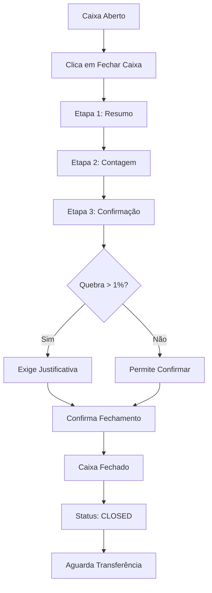

# ✅ Implementação: Fechamento de Caixa

## 📄 Página Criada

**Arquivo**: `web-app/src/pages/cash/CloseCashPage.tsx`

**Rota**: `/cash/sessions/:id/close`

## 🎯 Funcionalidades Implementadas

### Fluxo em 3 Etapas

#### 1️⃣ Etapa 1: Resumo do Caixa
- Exibe valor de abertura
- Mostra total de vendas (dinheiro, cartão, PIX)
- Lista sangrias e suprimentos
- **Destaca o valor esperado em dinheiro**

#### 2️⃣ Etapa 2: Contagem de Dinheiro
- Campos para contar cada denominação:
  - Notas: R$ 200, R$ 100, R$ 50, R$ 20, R$ 10, R$ 5, R$ 2
  - Moedas: R$ 1, R$ 0,50, R$ 0,25, R$ 0,10, R$ 0,05
- Cálculo automático do total por denominação
- **Total contado em destaque**

#### 3️⃣ Etapa 3: Confirmação
- Comparação: Valor Esperado vs Valor Contado
- **Cálculo automático da diferença (quebra)**
- Percentual de diferença
- Campo de justificativa (obrigatório se quebra > 1%)
- Alertas visuais para quebras significativas

## 🔍 Validações Implementadas

### Regras de Negócio (conforme spec)

1. ✅ **Quebra > 1%**: Justificativa obrigatória
2. ✅ **Quebra > 0,5%**: Notificação visual (amarelo)
3. ✅ **Sem quebra**: Confirmação verde
4. ✅ **Valor contado = 0**: Botão desabilitado

### Validações de Interface

- Campos numéricos com validação
- Botões desabilitados quando necessário
- Mensagens de erro claras
- Feedback visual em cada etapa

## 🎨 Design e UX

### Indicador de Progresso
```
[1] Resumo → [2] Contagem → [3] Confirmar
```

### Cores por Status
- **Verde**: Sem quebra ou sobra
- **Amarelo**: Quebra entre 0,5% e 1%
- **Vermelho**: Quebra > 1% (requer justificativa)
- **Laranja**: Ações principais

### Responsividade
- Layout adaptável para desktop e tablet
- Grid responsivo para denominações
- Cards informativos bem organizados

## 📊 Dados Enviados ao Backend

```typescript
POST /api/v1/cash/sessions/:id/close
{
  countedAmount: number,        // Total contado
  counts: [                     // Detalhamento por denominação
    {
      denomination: number,     // Ex: 100 (R$ 100)
      quantity: number,         // Ex: 5 (cinco notas)
      total: number            // Ex: 500 (R$ 500)
    }
  ],
  notes?: string               // Justificativa (se necessário)
}
```

## 🔄 Fluxo Completo



## 📝 Exemplo de Uso

### Cenário 1: Fechamento Sem Quebra
1. Operador clica em "Fechar Caixa"
2. Revisa o resumo (esperado: R$ 1.250,00)
3. Conta o dinheiro:
   - 10 notas de R$ 100 = R$ 1.000,00
   - 5 notas de R$ 50 = R$ 250,00
   - Total: R$ 1.250,00
4. Confirma (diferença: R$ 0,00) ✅
5. Caixa fechado com sucesso!

### Cenário 2: Fechamento Com Quebra Pequena (< 1%)
1. Operador clica em "Fechar Caixa"
2. Revisa o resumo (esperado: R$ 1.250,00)
3. Conta o dinheiro:
   - Total: R$ 1.245,00
4. Sistema mostra diferença: -R$ 5,00 (0,4%) ⚠️
5. Operador pode adicionar observação (opcional)
6. Confirma fechamento
7. Caixa fechado com alerta

### Cenário 3: Fechamento Com Quebra Grande (> 1%)
1. Operador clica em "Fechar Caixa"
2. Revisa o resumo (esperado: R$ 1.250,00)
3. Conta o dinheiro:
   - Total: R$ 1.230,00
4. Sistema mostra diferença: -R$ 20,00 (1,6%) 🚨
5. **Campo de justificativa obrigatório**
6. Operador explica: "Nota de R$ 20 rasgada, enviada para troca"
7. Confirma fechamento
8. Supervisor é notificado

## 🎁 Recursos Adicionais

### Navegação Intuitiva
- Botão "Voltar" em cada etapa
- Breadcrumb visual do progresso
- Cancelamento a qualquer momento

### Feedback Visual
- Loading states durante processamento
- Mensagens de erro claras
- Confirmação de sucesso

### Acessibilidade
- Labels descritivos
- Placeholders informativos
- Cores com bom contraste
- Foco visível nos campos

## 🔐 Segurança

- Requer autenticação
- Apenas operador do caixa pode fechar
- Validações no frontend e backend
- Auditoria completa no backend

## 📱 Responsividade

- Desktop: Layout em 2 colunas
- Tablet: Layout adaptado
- Mobile: Cards empilhados (se necessário)

## 🚀 Próximos Passos

Após o fechamento, o operador pode:
1. Ver o resumo do caixa fechado
2. Transferir para tesouraria
3. Imprimir relatório de fechamento
4. Abrir novo caixa (se autorizado)

## 📁 Arquivos Criados/Modificados

1. **Criado**: `web-app/src/pages/cash/CloseCashPage.tsx`
2. **Modificado**: `web-app/src/app/router.tsx`

---

**Status**: ✅ Implementado  
**Versão**: 1.0  
**Data**: 08/11/2024  
**Conforme Spec**: `.kiro/specs/cash-management-system/`
