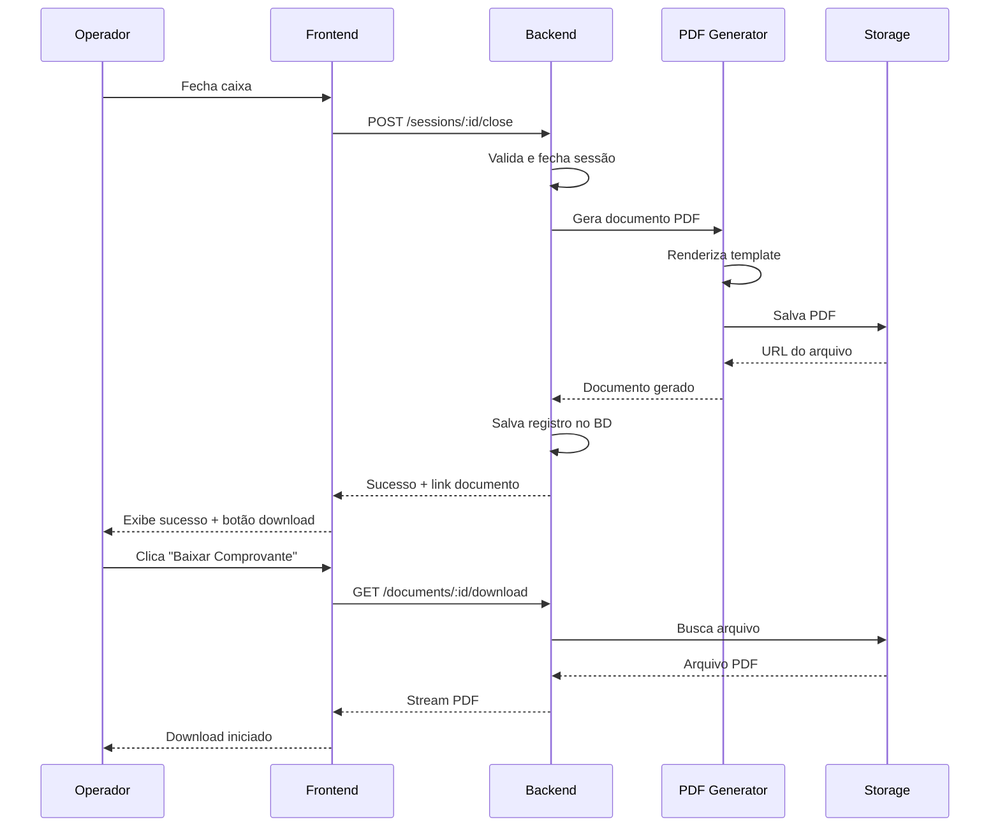

# 📋 Spec: Documento de Fechamento de Caixa

## 🎯 Objetivo

Criar sistema completo para geração de documentos de fechamento de caixa em PDF com campos para assinaturas e interface web para consulta histórica.

## 📁 Localização da Spec

`.kiro/specs/cash-closure-document/`

- `requirements.md` - Requisitos funcionais e não-funcionais
- `design.md` - Arquitetura e design detalhado
- `tasks.md` - Plano de implementação com 23 tarefas

## 🎨 Funcionalidades Principais

### 1. Geração Automática de Documento PDF

Ao fechar o caixa, o sistema gera automaticamente um documento PDF contendo:

**Cabeçalho:**
- Logo do estabelecimento
- Nome e CNPJ
- Número único do documento

**Dados do Fechamento:**
- Data/hora de abertura e fechamento
- Nome do operador
- Número do caixa
- Duração do turno

**Resumo Financeiro:**
- Valor de abertura
- Vendas por forma de pagamento (dinheiro, cartão, PIX)
- Sangrias realizadas
- Suprimentos recebidos
- Total de vendas

**Contagem de Dinheiro:**
- Tabela com cada denominação (R$ 200, R$ 100, R$ 50, etc.)
- Quantidade de cada
- Total por denominação

**Conferência:**
- Valor esperado em dinheiro
- Valor contado
- Diferença (quebra) com percentual
- Justificativa (se quebra > 1%)

**Campos para Assinatura:**
```
┌─────────────────────────────────────────┐
│ Operador de Caixa: [Nome]               │
│ Assinatura: ___________________________  │
│ Data: ___/___/___  Hora: ___:___        │
└─────────────────────────────────────────┘

┌─────────────────────────────────────────┐
│ Responsável pelo Recebimento:           │
│ Nome: __________________________________  │
│ Assinatura: ___________________________  │
│ Data: ___/___/___  Hora: ___:___        │
└─────────────────────────────────────────┘
```

**Rodapé:**
- Data/hora de geração
- Hash do documento (integridade)
- QR code para verificação online

### 2. Listagem de Fechamentos (Histórico)

Interface web para consultar todos os fechamentos realizados:

**Filtros:**
- Período (data início/fim)
- Operador
- Caixa
- Status (normal/alerta)

**Colunas da Tabela:**
- Nº Documento
- Data/Hora
- Operador
- Caixa
- Valor Esperado
- Valor Contado
- Diferença
- Status (badge colorido)
- Ações (ver detalhes, baixar PDF)

**Indicadores Visuais:**
- 🟢 Verde: Sem quebra
- 🟡 Amarelo: Quebra entre 0,5% e 1%
- 🔴 Vermelho: Quebra > 1%
- ⚠️ Ícone de alerta: Tem justificativa

**Funcionalidades:**
- Ordenação por qualquer coluna
- Paginação
- Exportação para Excel/CSV
- Download do PDF de qualquer fechamento

### 3. Detalhes do Fechamento

Página dedicada mostrando:

**Informações Completas:**
- Todos os dados do documento
- Timeline de transações do turno
- Detalhamento de cada transação
- Contagem de dinheiro realizada
- Justificativa completa (se houver)

**Ações:**
- Visualizar PDF
- Baixar PDF
- Reimprimir documento
- Ver histórico de acessos (auditoria)

### 4. Exportação de Dados

**Formatos Suportados:**
- Excel (.xlsx)
- CSV (.csv)

**Dados Exportados:**
- Todos os fechamentos do período
- Campos: data, operador, caixa, valores, diferença, status
- Nome do arquivo: `fechamentos_YYYYMMDD_HHMMSS.xlsx`

## 🔧 Implementação Técnica

### Backend

**Tecnologias:**
- PDFKit ou Puppeteer (geração de PDF)
- ExcelJS (exportação Excel)
- Prisma (banco de dados)

**Novos Endpoints:**
```typescript
POST   /api/v1/cash/sessions/:id/generate-document
GET    /api/v1/cash/documents/:id/download
GET    /api/v1/cash/closures
GET    /api/v1/cash/closures/:id
GET    /api/v1/cash/closures/export
```

**Novo Modelo:**
```prisma
model CashClosureDocument {
  id              String   @id @default(uuid())
  cashSessionId   String
  documentNumber  String   @unique
  generatedAt     DateTime @default(now())
  generatedBy     String
  pdfUrl          String
  hash            String
  metadata        Json
  
  cashSession     CashSession @relation(...)
  user            User        @relation(...)
}
```

### Frontend

**Novas Páginas:**
- `/cash/closures` - Listagem de fechamentos
- `/cash/closures/:id` - Detalhes do fechamento

**Componentes:**
- `ClosureHistoryPage` - Lista com filtros
- `ClosureDetailsPage` - Detalhes completos
- `ClosureListItem` - Item da lista com badges
- `DocumentViewer` - Visualizador de PDF

## 📊 Fluxo Completo



## 🔐 Segurança e Auditoria

**Imutabilidade:**
- Documentos não podem ser alterados após geração
- Hash garante integridade

**Auditoria:**
- Log de cada geração de documento
- Log de cada download
- Registro de quem acessou

**Permissões:**
- Geração: Operador de caixa
- Consulta histórico: Gerente/Admin
- Download: Gerente/Admin/Operador (próprio)

**Retenção:**
- Documentos mantidos por mínimo 5 anos
- Conformidade fiscal

## 📋 Plano de Implementação

### Fase 1: Database (2 tarefas)
- Criar modelo CashClosureDocument
- Executar migração

### Fase 2: Backend - Geração (5 tarefas)
- DocumentGeneratorService
- Geração de PDF
- Armazenamento de arquivos
- Repository
- Integração com fechamento

### Fase 3: Backend - Histórico (4 tarefas)
- ClosureHistoryService
- ExportService
- ClosureController
- Rotas

### Fase 4: Frontend - Histórico (4 tarefas)
- ClosureHistoryPage
- Componentes de visualização
- Funcionalidades de ação
- Rotas

### Fase 5: Frontend - Detalhes (3 tarefas)
- ClosureDetailsPage
- Seção de transações
- Ações do documento

### Fase 6: Integração (3 tarefas)
- Integrar com CloseCashPage
- Notificações
- Validações e erros

### Fase 7: Testes (2 tarefas opcionais)
- Testes automatizados
- Documentação

**Total: 23 tarefas (21 obrigatórias + 2 opcionais)**

**Tempo Estimado: 40-50 horas**

## ✅ Próximos Passos

1. **Revisar esta spec** - Confirme se atende todas as necessidades
2. **Aprovar o plano** - Valide as tarefas propostas
3. **Iniciar implementação** - Abra `.kiro/specs/cash-closure-document/tasks.md` e clique em "Start task"

## 📝 Observações

- A spec segue os padrões do sistema de gestão de caixa existente
- Integra-se perfeitamente com o fluxo atual de fechamento
- Atende requisitos fiscais e de auditoria
- Interface intuitiva para operadores e gerentes
- Documentos profissionais prontos para impressão

---

**Deseja revisar algum aspecto específico ou posso prosseguir com a implementação?**
